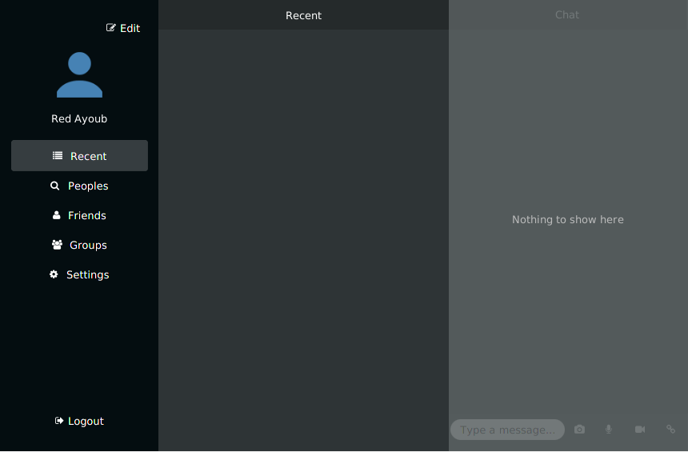
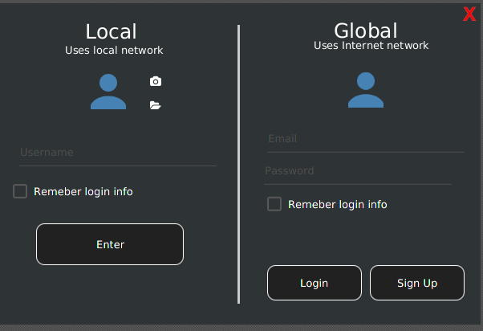
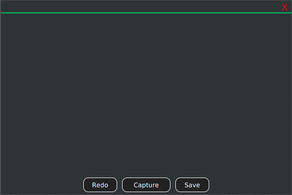
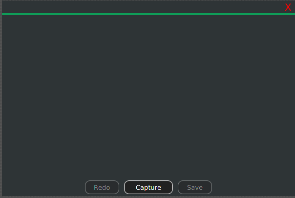

# Chat Client

A JavaFX client implmentes my chat server REST API https://github.com/redayoub47/chat_server allows users to communicate ( Text, Viedo, Audio, File) privatly or in groups 

## What I Learned
- Create a REST API Client
- Record Video and Audio
- Take Pictures from webcam
- Handle simultaneous API requests

## Screenshots 

## To run
1. Download the release file  
2. Make sure you have oracle jre v 8 or higher
3. Run the server https://github.com/redayoub47/chat_server
3. type in command line or terminal ` java -jar <filename>.jar 
